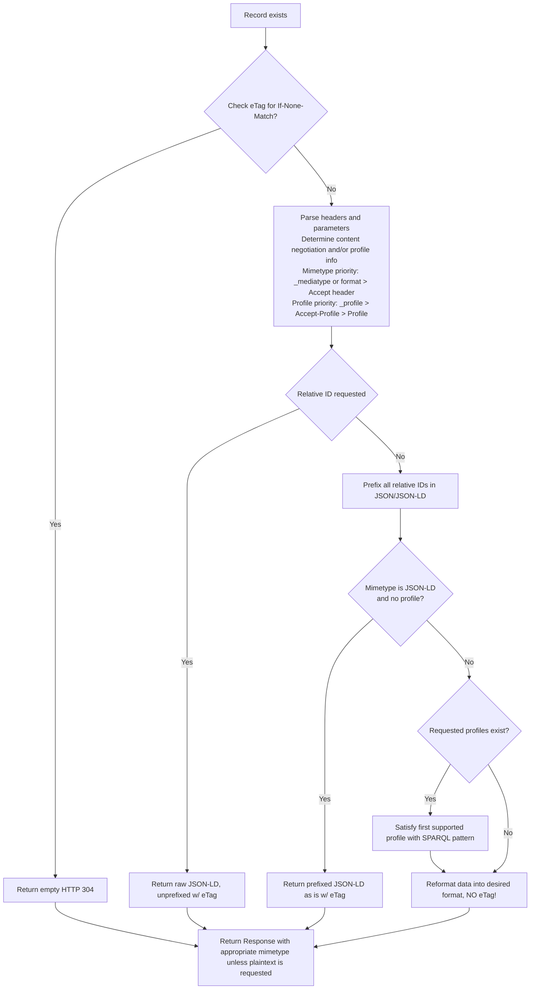

# Content Negotiation

## Overview

The LOD Gateway when configured to support RDF Processing provides support for both standard HTTP Content Negotiation of mimetype as well as data-specific support for [Content Negotiation by Profile from the W3C](https://www.w3.org/TR/dx-prof-onneg/).

The content negotiation supports requests using the HTTP Headers `Accept`, `Accept-Profile` and `Profile`, as well as URL Query String Arguments (QSA) `_profile`, `_mediatype` (or `format`). The `Accept` header is handled as standard. The `Accept-Profile` and `Profile` headers are handled as specified in [this section](https://www.w3.org/TR/dx-prof-conneg/#getresourcebyprofile) and use of the QSA [is outlined here](https://www.w3.org/TR/dx-prof-conneg/#qsa).

## Response flow

The following diagram outlines the broad decisions and priorities when determining what is preferred and acceptable based on the request received. 

## RDF Format Support

The following mimetypes are supported for the `_mediatype`, `format` or Accept header. The QSA parameter and the `format` parameter also supports a number of shorthand values for certain types, and these are the short strings shown after the mimetype below:

- `application/n-triples` (`application/ntriples` also accepted), "nt11"|"nt"
- `text/turtle`, "turtle"
- `application/rdf+xml`, "xml"
- `text/n3`, "n3"
- `application/n-quads`, "nquads"
- `application/ld+json`, "json-ld"
- `application/trig`, "trig"

## Force plain text mimetype in the response

The URL parameter `plaintext` or `force-plain-text` can be used to override the stated HTTP response mimetype. This is most useful when trying to view a given RDF format in a web browser when it does not support the RDF mimetype (even though it is a plain-text based format). For example, a browser will attempt to download a response in the N-Triples mimetype, rather than attempt to display it. Adding `&plaintext=true` to the parameters will give the response a mimetype of `text/plain` allowing the browser to display it.
