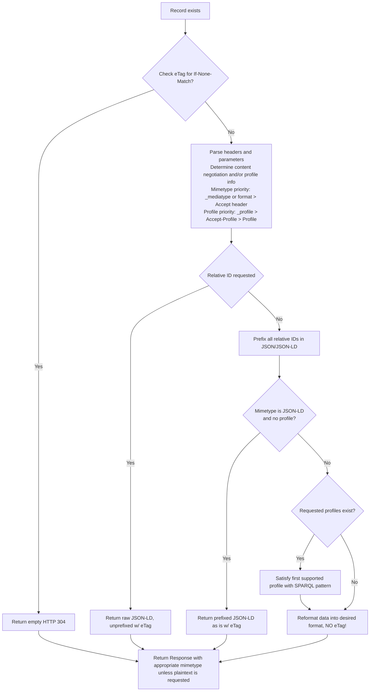

# Content Negotiation

## Overview

The LOD Gateway when configured to support RDF Processing provides support for both standard HTTP Content Negotiation of mimetype as well as data-specific support for [Content Negotiation by Profile from the W3C](https://www.w3.org/TR/dx-prof-onneg/) (aka CNBP).

The content negotiation supports requests using the HTTP Headers `Accept`, and `Accept-Profile`, as well as URL Query String Arguments (QSA) `_profile`, `_mediatype` (or `format`). The `Accept` header is handled as standard. The `Accept-Profile` header are handled as specified in [this section](https://www.w3.org/TR/dx-prof-conneg/#getresourcebyprofile) and use of the QSA [is outlined here](https://www.w3.org/TR/dx-prof-conneg/#qsa).

## What CNBP aspects are supported

- HEAD/GET requests on resources return Link headers that specify the alternate profiles that the resource can be retrieved as.
- QSA pattern support for resource retrieval under a given profile (eg `http://example.org/a&_profile=...`)
- Accept-Profile header support for resource retrieval under a given profile (eg `Accept-Profile: <http://my.profile.spec/1>`)
- Accept header and QSA `_mediatype` and `format` parameters can be used to render the resource in alternate RDF formats (eg `http://example.org/a&format=nt` or `Accept: application/n-triples`).
- The list of both the acceptable profiles and RDF formats can be specified in the same request, and the best combination will be used to form the response.

## What CNBP aspects LOD Gateway does NOT Support
The LOD Gateway does NOT have a full implementation of every suggested access pattern CNBP W3C specification, and supports only the QSA patterns, and the Accept-Profile header for accessing a resource rendered under a selected profile.
- Getting a profiled resource by using a profile key:value statement within an Accept header. For example `Accept: application/ld+json;charset=UTF-8;profile=<http....>`. This has been omitted from the first release of this functionality for simplicity but may be added in at a later date. This would be treated as lower priority than Accept-Profile, and the profile would inherit the q-values for the Accept mimetype it applies to.
- Getting a profiled resource by using Link headers in the request. The Link header format is tricky to parse, and to form correctly, and the QSA pattern or the use of Accept-Profile are a much more robust path, and much easy to test and use especially by editing URLs in a browser. If compatibility with this request pattern is required, it will be added at a later date.

## Response flow

The following diagram outlines the broad decisions and priorities when determining what is preferred and acceptable based on the request received. 



## RDF Format Support

The following mimetypes are supported for the `_mediatype`, `format` or Accept header. The QSA parameter and the `format` parameter also supports a number of shorthand values for certain types, and these are the short strings shown after the mimetype below:

- `application/n-triples` (`application/ntriples` also accepted), "nt11"|"nt"
- `text/turtle`, "turtle"
- `application/rdf+xml`, "xml"
- `text/n3`, "n3"
- `application/n-quads`, "nquads"
- `application/ld+json`, "json-ld"
- `application/trig`, "trig"

## Force plain text mimetype in the response

The URL parameter `plaintext` or `force-plain-text` can be used to override the stated HTTP response mimetype. This is most useful when trying to view a given RDF format in a web browser when it does not support the RDF mimetype (even though it is a plain-text based format). For example, a browser will attempt to download a response in the N-Triples mimetype, rather than attempt to display it. Adding `&plaintext=true` to the parameters will give the response a mimetype of `text/plain` allowing the browser to display it.

## Link Header responses

In the Link Header response from a resource request, there will be a number of additional 'links' corresponding to the canonical version of the resource, as well as any applicable versions that conform to profiles. This enables the client to determine what the profile options are for a given resource.

The base URL for a resource will be `rel="canonical"`, and the profiled versions will have `rel="alternate"` with a format statement indicating which profile they conform to.

## Writing SPARQL Patterns for Profile Generation

This requires:
- A SPARQL CONSTRUCT query that contains a single `$URI` parameter that represents the resource's URI.
- a profile URI (`profile_uri`)
- a list of applicable types (`applies_to`)

The `profile_uri` and the `applies_to` parameters are not used within the 

```
Python 3.13.3 (v3.13.3:6280bb54784, Apr  8 2025, 10:47:54) [Clang 15.0.0 (clang-1500.3.9.4)] on darwin
Type "help", "copyright", "credits" or "license" for more information.
(InteractiveConsole)
>>>
>>> from gettysparqlpatterns import PatternSet
>>> from lodgatewayclient import LODGatewayClient
>>> p = PatternSet(name="Content Profiles")
>>>
>>> p.add_pattern(name="dc:title",
...               sparql_pattern="""
... PREFIX dc: <http://purl.org/dc/elements/1.1/>
... PREFIX rdfs: <http://www.w3.org/2000/01/rdf-schema#>
... CONSTRUCT {
...   <$URI> dc:title ?title .
... } WHERE {
...  SELECT ?title WHERE {
...     <$URI> rdfs:label ?title .
...   }
... }""",
...               stype="construct",
...               profile_uri="urn:getty:dctitle",
...               applies_to=["InformationObject", "Person", "HumanMadeObject"]
... )

>>> # Make the PatternSet run queries against the LODGatewayClient SPARQL endpoint by default
>>> p.use_lodgateway_for_queries(LODGatewayClient("https://data.getty.edu/research/collections/"))

>>> for triple in p.run_pattern("dc:title", URI="https://data.getty.edu/research/collections/component/ccc3cb32-8c53-5a93-8f13-4bff30fef52a"):
...   print(triple['subject'], triple['predicate'], triple['object'])
...
https://data.getty.edu/research/collections/component/ccc3cb32-8c53-5a93-8f13-4bff30fef52a http://purl.org/dc/elements/1.1/title collection
https://data.getty.edu/research/collections/component/ccc3cb32-8c53-5a93-8f13-4bff30fef52a http://purl.org/dc/elements/1.1/title Allan Sekula papers
```

Once the profiles are ready, they can be exported so that they can be loaded, or added to the existing set of profiles in an LOD Gateway. If there is an existing profile PatternSet, append the new patterns from the `patterns` list onto the existing PatternSet list. The pattern `name` for each one should be unique within that list as well.

```
>>> # p.export_patterns() creates the JSON-encodable representation
>>> import json
>>> print(json.dumps(p.export_patterns(), indent=2))
{
  "name": "Content Profiles",
  "description": "No description given.",
  "url": null,
  "patterns": [
    {
      "name": "dc:title",
      "description": "No description given",
      "sparql_pattern": "\nPREFIX dc: <http://purl.org/dc/elements/1.1/>\nPREFIX rdfs: <http://www.w3.org/2000/01/rdf-schema#>\nCONSTRUCT {\n  <$URI> dc:title ?title .\n} WHERE {\n SELECT ?title WHERE {\n    <$URI> rdfs:label ?title .\n  }\n}",
      "stype": "construct",
      "keyword_parameters": [
        "URI"
      ],
      "default_values": {},
      "applies_to": [
        "InformationObject",
        "Person",
        "HumanMadeObject"
      ],
      "ask_filter": null,
      "framing": null,
      "profile_uri": "urn:getty:dctitle"
    }
  ]
}
```